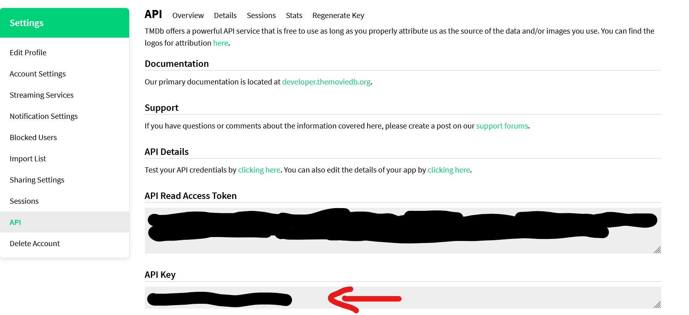

<h1>What is My Media?</h1>
<b> My Media</b> is a platform to browse and showcase your favourite movies, shows, and music all in one convenient 
place <i>hopefully providing an easy answer to the question "what's your favourite ___"</i>.<br/>

<br><br>

Search for all your favourite songs, niche movies, and sitcoms

<br><br>

View info like user ratings, release, genres, and movie brief. 
You can then like it to add to your profile

<br><br>

Customize your profile with all your favourites and connect to Spotify to show what songs have been stuck in your head
and which one you're listening to now!

<br><br>

<h2>Prerequisites and Setup</h2>
To setup the project packages use "pip install -r requirements.txt". All required packages will be downloaded.

<br><br>

Next we need to setup your Django project.

<h2><b>DJANGO</b></h2>

First, we need a secret key for generating hashes. Create a plain file called '.env' in the <b>ROOT</b> directory.  Then get your secret key. 
Go to [this link](https://djecrety.ir/) and generate then copy your key.

Now paste your key into your .env file like so:
```
# don't put quotes around your key
SECRET_KEY=key_here
```

You're on a roll! Lets keep going.

<h3>DATABASES!!</h3>

By default, your cloned version of the project won't have a database, for very obvious reasons. Don't worry Django will
make a new one for you. What it wont do is generate our necessary tables. So lets do that.

Enter the following into your terminal:

```
# some people have issues with this, if py doesnt work try python
py manage.py migrate
```

This is going to do some fun SQL magic that creates our tables. Either way, since that is now setup
we can get on to adding our...

<h2>APIS AND KEYS AND THINGS</h2>
This project uses both TMDB (The Movie Database) and Spotify for querying and data retrieval. Why?
The simple answer is because of their massive databases, powerful querying tools, and ease of use.
Also because they have dev friendly Python wrappers.

As all APIs do, they require authentication, so we're going to need to...

<h3>Get your keys!</h3>
All API methods and setup methods are stored in "spotipy_api.py" and "tmdb_api"

<br><br>

Both of these files import their keys and/or ID's from a file called "api_keys.py". This isn't included in the repository
because initially I was not planning on adding keys in the repo, but we'll get to that. 
For now, lets look at how they're imported.

<br><br>
<br><br>

<b>This is notoriously known to be bad practice</b>. If you wish to store your keys as environment variables, 
the documentation for both API wrappers explain how to do so:
* [TMDB](https://pypi.org/project/tmdbv3api/)
* [Spotipy](https://spotipy.readthedocs.io/en/2.24.0/)


If you don't want to refactor this whole project, create a new file in the <b>ROOT</b> directory called "api_keys.py".

Copy the following code block into your "api_keys.py" file:
```
tmdb_key = 'xxxxxx'
SPOTIPY_CLIENT_ID='xxxxxx'
SPOTIPY_CLIENT_SECRET='xxxxxx'

SPOTIPY_REDIRECT_URI='xxxxxx'
```
<h5>TMDB Key</h5>

To acquire your TMDB api key, go to the link and follow the given steps.
1. TMDB ([API Key Setup](https://developer.themoviedb.org/docs/getting-started))<br>
    * Used for all sources of Movie and TV assets and their data

After creating an account and gaining API access, you should see two keys.
You are going to copy the <b>API Key</b> and paste it into your "api_keys.py" file we created and paste the key in the 
"<b>tmdb_key</b>" variable value.
Wow, look at you go!

<br><br>

<b>The next steps show you how to create a Spotify app to use the music features of the site</b>

Firstly, create a spotify account [here](https://www.spotify.com/us/signup) <i>if you don't have one already</i>. Now using your
Spotify account, we are going to link it as a developer account. Go to the following link and login
to your Spotify account. Accept the developer terms and conditions and you're all set.

2. Spotify ([Dev Account Creation](https://developer.spotify.com/dashboard))
   * Used for all music data and assets


If not redirected automatically, after logging in proceed to your developer dashboard by clicking on your profile on the top right
and selecting "dashboard".

<br><br>

After going to your dashboard, you'll be confronted with a screen and a button that says "create app".
Apps are the middle man between your project and Spotify data. These apps inform Spotify who is using their data
and what data they're requesting.

They're also helpful for Spotify users, as the app and the scope of the app is shown to them when they are linking 
their account. Users can also unlink from your app through the Spotify platform as well. So choose a name representitive
of the project.

Now that you have an idea of what an app is, lets make one. Click "create app".

<br><br>

After clicking create, you will see a series of input fields. Fill them out like so:

<br><br>

You can fill out the fields however you want <b>EXCEPT</b> the redirect URI. 
It must be "http://127.0.0.1:8000/spotify-auth". This is the URL responsible for redirecting an authenticated Spotify user,
I have the views configured to get Spotify token data from this URL. You can change it if you wish, but you will also have to 
refactor the code to mirror your new URL <i>(why its called a URI to Spotify is beyond me)</i>. 

Ensure you click the Add button next to the URI field, if not, your URI won't be added to the app.
  
For the last section, check the boxes like so then click "Save" when done:

<br><br>

After creating your app, you should be redirected to your new app's overview page. Next, you are going to want to click 
"settings". If you are at the dashboard page, simply click on your app to get to the overview.

<br><br>

Now <i>finally</i>, you should see your API keys and IDs, simply copy them and enter them into the corrisponding
variables in your "api_keys.py" file.

When attempting to query for music without the having linked your created account to Spotify,
the OAuth method for Spotify will initiate a sign in prompt. If you do not sign in
to Spotify, you will not be able to use any music based features of the site.

You do not need a premium Spotify account for it to work. Spotify is just used as a back-bone for search querying and
user music data.

and thats it! Type the following into your command line to get started using MyMedia!
```
py manage.py runserver
```

<h2>Using MyMedia</h2>

There honestly isn't much to write here. The site is built to be self-contained and hopefully easy to figure out. No 
initial data is needed. Just make an account, customize your profile, and start liking different media.

There are a few small features that you may not be aware of when navigating.

<h5>Music</h5>

When viewing a song result item, you can click on things like name of the artist or album a song is from to be redirected
to their respective details page. This is just so you dont have to re-query if you wanted to add an artist, or album to
your likes.

<br><br>

If clicked on an album for example, you can then also click on any song in the album to be redirected to song info:

<br><br>

You can also do the same for artists and their albums (excluding EPs):
<br><br>

**IMPORTANT NOTE**:
Your Spotify login is only valid for as long as the Django session is. So if you clear your browser, don't use the site for an extended period of time, or sign out, you will have to relink your Spotify.
Since your browser will cache your Spotify login automatically, all you have to do is click "link Spotify" and it will relink with your token.

Alright, I'm done yapping. Go have fun making lists of media and stuff.

side thing: (I want to attempt to deploy this to learn the process, so if you have any UX concerns, tips, or anything
related to making Django project ready for prod, that'd be super nice)
